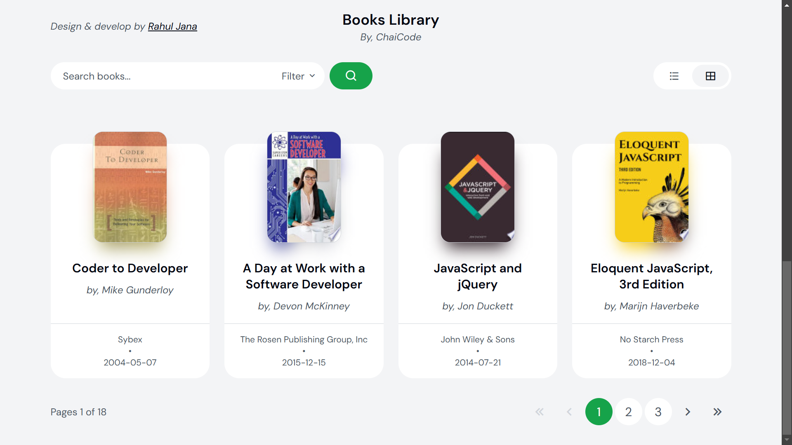

# Books Library Application

## Features

- Fetch books from the API and display them as a list/grid & you can switch between list and grid.
- Showing book details including title, author, publisher, published date, and thumbnail.
- Implement a search bar to filter books by title or author.
- Implement a sort feature to list books in Alphabetical order based on their title, date of release (publishedDate)
- Implement pagination on reaching the end of the page to call next set of details
- Clicking on a book item, should open more details in a new tab (using infoLink)

## Screenshots


## Deployment Link
[Live Demo]()

## How to Use

- Books are displayed in both list and grid formats, with 12 books visible per page.
- Users can toggle seamlessly between grid and list views.
- Clicking on a book provides detailed information about it.
- The application is fully responsive, offering an optimal experience on both small and large screens.
- It ensures smooth navigation and accessibility across different devices.

## Installation

1. Clone the repository:
   ```sh
   git clone https://github.com/janarahul1234/Books-Library.git
   ```
2. Open `index.html` in a browser.
3. Start reading new quotes!

### Technologies Used
- HTML
- CSS
- JavaScript

## Contributing
Feel free to submit issues or pull requests to improve the application.

## License
This project is open-source and available under the [MIT License](LICENSE).